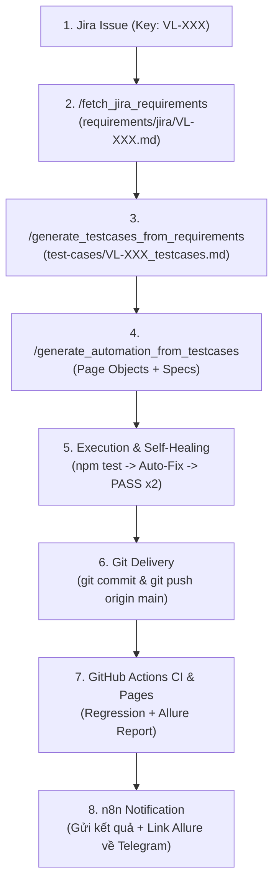

# Workflow: E2E Jira to Automation Pipeline

> **Mục tiêu:** Tự động hóa toàn diện quy trình kiểm thử từ lúc có yêu cầu trên Jira cho đến khi code automation được kiểm tra kỹ lưỡng, PASS trên local, được push lên Git, kích hoạt CI và gửi báo cáo về Telegram.



---

## Các Bước Thực Hiện Chi Tiết

### Bước 1: Lấy Requirements từ Jira (`/fetch_jira_requirements`)
1. Nhận `JIRA_KEY` (ví dụ: `VL-101`) từ người dùng hoặc từ Webhook n8n.
2. Thực thi script fetcher:
   ```bash
   node scripts/integrations/jira/jira_fetcher.js --issue <JIRA_KEY> --format md --output ./requirements/jira
   ```
3. Đọc nội dung file Markdown vừa tạo tại `requirements/jira/<JIRA_KEY>.md` để nắm rõ User Story, Acceptance Criteria, và Business Rules.

---

### Bước 2: Sinh Manual Test Cases Nhanh (`/generate_testcases_from_requirements`)
1. Áp dụng kỹ thuật phân tích biên (BVA), phân vùng tương đương (EP), và Field-Level Validation theo skill `rbt_manual_testing`.
2. Tạo file test cases chuẩn tại `test-cases/<JIRA_KEY>_testcases.md` gồm các cột:
   - `TC ID`: format `[MODULE]_TC_[SỐ]`
   - `Test Scenario`
   - `Pre-conditions`
   - `Test Steps`
   - `Expected Result`
   - `Test Data` (cụ thể, traceable)
   - `Priority`, `Automatable` (Yes/No), `Auto Type` (UI/API)
3. Lưu file và xác nhận danh sách các test case cần chuyển thành Automation.

---

### Bước 3: Chuyển Test Cases Thành Automation Script (`/generate_automation_from_testcases`)
1. Tuân thủ tuyệt đối quy tắc kiến trúc POM của dự án:
   - **Page Objects (`page-object/*.ts`):** Chỉ chứa Scoped Semantic Locators (`getByRole`, `getByPlaceholder`, `getByLabel`) và User Actions. **TUYỆT ĐỐI KHÔNG chứa `expect()` trong Page Class**.
   - **Test Specs (`tests/ui/*.spec.ts` hoặc `tests/api/*.spec.ts`):** Nhận Page Object từ fixture (`fixture/page-fixture.ts`), thực hiện các bước và Web-First Assertions trực tiếp tại tầng Test.
2. Nếu là UI Test: Mở trình duyệt để inspect DOM thực tế, không đoán locator.
3. Nếu là API Test: Tận dụng các services có sẵn trong `services/` hoặc tạo mới theo domain.

---

### Bước 4: Thực Thi Kiểm Thử & Tự Sửa Lỗi Cục Bộ (Self-Healing Loop)
1. Chạy test suite cục bộ:
   ```bash
   cmd.exe /c "npm test"
   ```
2. **Quy tắc E3 (CRITICAL):**
   - Nếu có test case bị FAIL $\rightarrow$ Đọc log lỗi chi tiết $\rightarrow$ Phân tích nguyên nhân (Locator thay đổi, Timing, hay Logic assertion) $\rightarrow$ Tự động sửa mã nguồn $\rightarrow$ Chạy lại.
   - **Không dừng lại hay hỏi người dùng** cho đến khi test **PASS 100%**.
3. **Tiêu chuẩn Definition of Done:** Test suite phải **PASS ít nhất 2 lần liên tiếp** trên local trước khi được phép bàn giao.
4. Chạy `npm run typecheck` để đảm bảo không có lỗi TypeScript.
5. Dọn dẹp thư mục tạm: `npm run clean`.

---

### Bước 5: Đẩy Mã Nguồn Lên GitHub (Git Delivery)
1. Kiểm tra trạng thái: `git status`.
2. Stage và commit với message chuẩn Conventional Commits:
   ```bash
   git add .
   git commit -m "feat(test): implement automated tests for Jira <JIRA_KEY>"
   git push origin main
   ```

---

### Bước 6: GitHub Actions Chạy CI & n8n Báo Cáo Telegram
1. GitHub Actions trên repo `Khoi67/ai-automation-test` tự động kích hoạt workflow `Playwright Tests`.
2. Allure Report được cập nhật trực tuyến trên GitHub Pages: `https://khoi67.github.io/ai-automation-test/`.
3. n8n nhận Webhook sự kiện `workflow_run` hoàn thành từ GitHub.
4. n8n tự động bắn thông báo thành công về Telegram:
   - Mã vé Jira: `[<JIRA_KEY>]`
   - Tiêu đề tính năng
   - Trạng thái: ✅ **PASS HOÀN TOÀN**
   - Link Allure HTML Report xem ngay trên trình duyệt.
