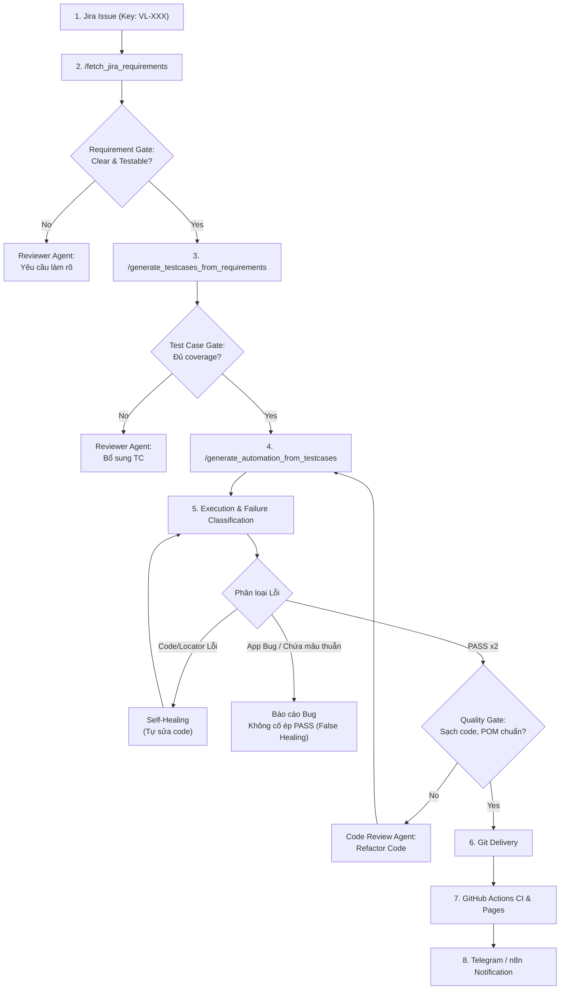

# Workflow: E2E Jira to Automation Pipeline (Advanced with Quality Gates)

> **Mục tiêu:** Tự động hóa toàn diện quy trình kiểm thử từ lúc có yêu cầu trên Jira cho đến khi code automation được kiểm tra kỹ lưỡng, PASS trên local, được push lên Git, kích hoạt CI và gửi báo cáo về Telegram. Đảm bảo tính chính xác cao nhất thông qua các Quality Gates và cơ chế phân loại lỗi (Failure Classification).



---

## Các Bước Thực Hiện Chi Tiết

### Bước 1: Lấy Requirements từ Jira (`/fetch_jira_requirements`)
0. Gửi thông báo: `node scratch/notify.js "Bắt đầu Bước 1: Kéo Requirement từ Jira cho ticket <JIRA_KEY>"`
1. Nhận `JIRA_KEY` (ví dụ: `VL-101`) từ người dùng hoặc từ Webhook n8n.
2. Thực thi script fetcher để lấy requirement format MD.
3. **Requirement Gate (Validation):**
   - Đánh giá xem Requirement đã đủ rõ ràng để viết test chưa? (Có acceptance criteria, có thiết kế không?)
   - Nếu chưa rõ: Trả kết quả báo "Requirement chưa đủ điều kiện, cần bổ sung".

---

### Bước 2: Sinh Manual Test Cases (`/generate_testcases_from_requirements`)
0. Gửi thông báo: `node scratch/notify.js "Bắt đầu Bước 2: Sinh Manual Test Cases cho ticket <JIRA_KEY>"`
1. Áp dụng kỹ thuật phân tích biên (BVA), phân vùng tương đương (EP), và Field-Level Validation theo skill `rbt_manual_testing`.
2. Tạo file test cases chuẩn tại `test-cases/<JIRA_KEY>_testcases.md`.
3. **Test Case Gate (Validation):**
   - Đã cover đủ happy path, negative path và edge cases chưa?
   - Test data có traceable không?

---

### Bước 3: Chuyển Test Cases Thành Automation Script (`/generate_automation_from_testcases`)
0. Gửi thông báo: `node scratch/notify.js "Bắt đầu Bước 3: Sinh Automation Scripts cho ticket <JIRA_KEY>"`
1. Tuân thủ tuyệt đối quy tắc kiến trúc POM của dự án:
   - **Page Objects (`page-object/*.ts`):** Chỉ chứa Scoped Semantic Locators và User Actions. Không chứa `expect()`.
   - **Test Specs (`tests/ui/*.spec.ts`):** Nhận Page Object từ fixture, thực hiện các bước và Web-First Assertions trực tiếp tại tầng Test.
2. Dùng Web-First assertions, không dùng hard-coded sleep.

---

### Bước 4: Thực Thi Kiểm Thử & Phân Loại Lỗi (Failure Classification)
0. Gửi thông báo: `node scratch/notify.js "Bắt đầu Bước 4: Chạy Test & Phân loại lỗi cho ticket <JIRA_KEY>"`
1. Chạy test suite cục bộ: `npm test`
2. **Failure Classification (CRITICAL):**
   - Thay vì mù quáng "thấy FAIL là tự sửa code test cho đến khi PASS" (gây ra False Healing), phải **phân tích root cause**:
     - **Nguyên nhân 1 (Lỗi Automation):** Do locator sai, timeout, logic test sai $\rightarrow$ **Kích hoạt Self-Healing (Tự sửa code automation)**.
     - **Nguyên nhân 2 (Lỗi Ứng dụng / Bug thực sự):** Test logic đúng nhưng app hoạt động sai so với requirement $\rightarrow$ **DỪNG LẠI, đánh dấu FAILED và tự động log BUG lên Jira**.
       - Agent tự gọi script (tự động đồng bộ Precondition, Steps, Expected chuẩn xác 100% từ Test Case): 
         ```bash
         node scripts/integrations/jira/jira_create_bug.js \
           --parent <JIRA_KEY> \
           --tc <TC_ID> \
           --summary "[<Module>] <BUG_TITLE>" \
           --actual "<ACTUAL_RESULT>" \
           --attachment "auto"
         ```
       - Tuyệt đối không sửa code test để "ép" kết quả thành PASS.
3. **Quality Gate:** Code đã clean chưa? Không còn `console.log`, không hard-code credentials, tuân thủ chặt POM.
4. **Tiêu chuẩn Definition of Done:** Test suite phải **PASS ít nhất 2 lần liên tiếp** trên local (hoặc Failed do Bug app hợp lệ).
5. **Báo Cáo Kết Quả Kiểm Thử Về Telegram (Approval Gate):**
   - Agent thực thi script gửi kết quả kiểm thử kèm nút bấm phê duyệt Push:
     ```bash
     node scripts/integrations/report_local_test.js \
       --ticket <JIRA_KEY> \
       --pass <PASSED_COUNT> \
       --fail <FAILED_COUNT> \
       --bugs <BUGS_COUNT> \
       --duration <SECONDS> \
       --files "<FILE1,FILE2>"
     ```
   - **DỪNG LẠI & CHỜ DUYỆT:** Agent KHÔNG tự ý push Git ngay. Tester sẽ xem báo cáo trên Telegram hoặc IDE và quyết định duyệt.

---

### Bước 5: Phê Duyệt & Đẩy Mã Nguồn Lên GitHub (Git Delivery & Jira Transition)
1. Khi Tester bấm nút `[🚀 Duyệt & Push Git (<JIRA_KEY>)]` trên Telegram (hoặc ra lệnh trực tiếp trên IDE):
   - Bot ghi nhận phê duyệt vào `scratch/push_trigger.txt`.
2. Agent thực thi script bàn giao tự động:
   ```bash
   node scripts/integrations/git_push_delivery.js --ticket <JIRA_KEY>
   ```
   - Tự động kiểm tra `git status`.
   - Stage và commit với message chuẩn: `feat(automation): add test suite and POM for <JIRA_KEY>`.
   - Push lên nhánh `main`.
   - Chuyển trạng thái Jira sang **"In Review"** qua `jira_transition.js`.
   - Gửi thông báo hoàn tất bàn giao về Telegram.

---

### Bước 6: CI/CD & Báo Cáo Tổng Kết
1. GitHub Actions tự động kích hoạt workflow `Playwright Tests` trên Cloud khi có commit mới trên nhánh `main`.
2. Báo cáo kiểm thử Allure Report được cập nhật lên GitHub Pages.
