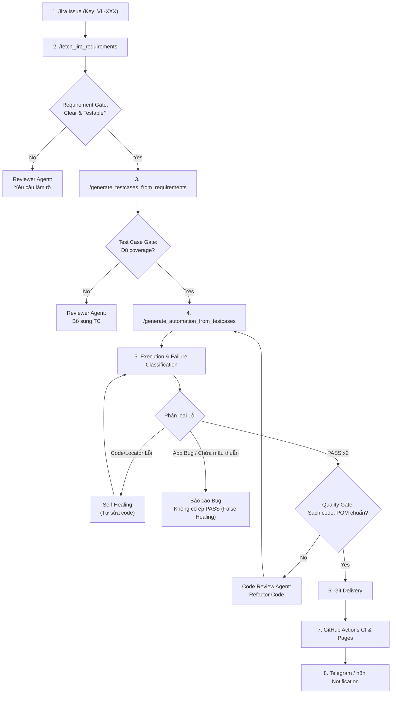

# Workflow: E2E Jira to Automation Pipeline (Advanced with Quality Gates)

> **BẮT BUỘC TUÂN THỦ (MANDATORY RULES):** Bạn PHẢI nạp và tuân thủ tuyệt đối các quy tắc sau trong suốt pipeline:
> - **`automation_rules.md`** (`.agent/rules/automation_rules.md`): Chuẩn POM, Naming convention, Clean Code, Test Independence.
> - **`playwright_rules.md`** (`.agent/rules/playwright_rules.md`): Desktop viewport `1920x1080`, Headed mode khi debug, Semantic locators, Smart waits.
> - **`locator_strategy.md`** (`.agent/rules/locator_strategy.md`): 4-Tier Locator Priority, cấm absolute XPath và dynamic IDs.
> - **`api_rules.md`** (`.agent/rules/api_rules.md`): Quy chuẩn API Testing, Status assertions, Auth lifecycle.
>
> **Mục tiêu:** Tự động hóa toàn diện quy trình kiểm thử từ lúc có yêu cầu trên Jira cho đến khi code automation được kiểm tra kỹ lưỡng, PASS trên local, được push lên Git, kích hoạt CI và gửi báo cáo về Telegram. Đảm bảo tính chính xác cao nhất thông qua các Quality Gates và cơ chế phân loại lỗi (Failure Classification).


```mermaid
flowchart TD
    A["1. Jira Issue (Key: VL-XXX)"] --> B["2. /fetch_jira_requirements"]
    B --> G1{"Requirement Gate:\nClear & Testable?"}
    G1 -- No --> R1["Reviewer Agent:\nYêu cầu làm rõ"]
    G1 -- Yes --> C["3. /generate_testcases_from_requirements"]
    
    C --> G2{"Test Case Gate:\nĐủ coverage?"}
    G2 -- No --> R2["Reviewer Agent:\nBổ sung TC"]
    G2 -- Yes --> D["4. /generate_automation_from_testcases"]
    
    D --> E["5. Execution & Failure Classification"]
    E --> F_Class{"Phân loại Lỗi"}
    
    F_Class -- "Code/Locator Lỗi" --> AutoFix["Self-Healing\n(Tự sửa code)"]
    AutoFix --> E
    
    F_Class -- "App Bug / Chứa mâu thuẫn" --> Bug["Báo cáo Bug\nKhông cố ép PASS (False Healing)"]
    
    F_Class -- "PASS x2" --> G3{"Quality Gate:\nSạch code, POM chuẩn?"}
    
    G3 -- No --> R3["Code Review Agent:\nRefactor Code"]
    R3 --> D
    
    G3 -- Yes --> F["6. Git Delivery"]
    F --> G["7. GitHub Actions CI & Pages"]
    G --> H["8. Telegram / n8n Notification"]
```

---

## Các Bước Thực Hiện Chi Tiết

### Bước 1: Lấy Requirements từ Jira (`/fetch_jira_requirements`)
0. Gửi thông báo: `node scripts/integrations/notify_step.js --ticket <JIRA_KEY> --step 1 --title "Kéo Requirement từ Jira" --detail "Bắt đầu lấy User Story và tiêu chí chấp nhận"`
1. Nhận `JIRA_KEY` (ví dụ: `SCRUM-19`) từ người dùng hoặc từ file `trigger.txt`.
2. **Tự động chuyển trạng thái Ticket trên Jira từ To Do sang In Progress:**
   ```bash
   node scripts/integrations/jira/jira_transition.js --issue <JIRA_KEY> --status "In Progress"
   ```
3. Thực thi script fetcher để lấy requirement format MD:
   ```bash
   node scripts/integrations/jira/jira_fetcher.js --issue <JIRA_KEY>
   ```
4. **Requirement Gate (Validation):**
   - Đánh giá xem Requirement đã đủ rõ ràng để viết test chưa? (Có acceptance criteria, có thiết kế không?)
   - Nếu chưa rõ: Trả kết quả báo "Requirement chưa đủ điều kiện, cần bổ sung".

---

### Bước 2: Sinh Manual Test Cases (`/generate_testcases_from_requirements`)
0. Gửi thông báo: `node scripts/integrations/notify_step.js --ticket <JIRA_KEY> --step 2 --title "Sinh Manual Test Cases" --detail "Áp dụng kỹ thuật phân tích biên và phân vùng tương đương"`
1. Áp dụng kỹ thuật phân tích biên (BVA), phân vùng tương đương (EP), và Field-Level Validation theo skill `rbt_manual_testing`.
2. Tạo file test cases chuẩn tại `test-cases/<JIRA_KEY>_testcases.md`.
3. **Test Case Gate (Validation):**
   - Đã cover đủ happy path, negative path và edge cases chưa?
   - Test data có traceable không?

---

### Bước 3: Chuyển Test Cases Thành Automation Script (`/generate_automation_from_testcases`)
0. Gửi thông báo: `node scripts/integrations/notify_step.js --ticket <JIRA_KEY> --step 3 --title "Sinh Automation Scripts" --detail "Viết Page Object Model và Test Specs"`

1. **Rà soát Tái Sử Dụng & Tuân Thủ DRY (MANDATORY - Reusability First):**
   Trước khi viết bất kỳ dòng code nào, Agent **BẮT BUỘC** thực hiện audit 5 tầng tái sử dụng để chống lặp code (Don't Repeat Yourself):
   - **Tầng 1 - Page Objects & Components (`page-object/`):**
     - Rà soát các file trong `page-object/` và `page-object/components/`.
     - Nếu trang/màn hình đã có class Page Object (ví dụ: `ProfilePage`, `LoginPage`, `HomePage`, `HeaderComponent`): **BẮT BUỘC tái sử dụng và mở rộng (extend)** thêm locator hoặc user action mới vào class hiện có. **TUYỆT ĐỐI KHÔNG TẠO CLASS TRÙNG LẶP** (ví dụ: không tạo `profile-avatar-page.ts` hay `user-profile.ts` khi đã có `profile-page.ts`).
     - Các thành phần xuất hiện trên nhiều trang (Header, Footer, Navigation, Modal confirm/alert) phải nằm trong `page-object/components/` và tích hợp vào Page class qua composition (`this.header = new HeaderComponent(page)`), không khai báo lại locators của Header/Footer ở từng Page riêng lẻ.
   - **Tầng 2 - Fixtures Injection (`fixture/`):**
     - Inject Page Objects thông qua fixture (`fixture/index.ts`). Trong file spec: nhận thẳng Page Object làm fixture param (`async ({ profilePage, homePage }) => { ... }`).
     - **CẤM** khởi tạo thủ công `const profilePage = new ProfilePage(page)` lặp đi lặp lại trong mỗi test case.
   - **Tầng 3 - Workflows Nghiệp Vụ (`workflow/`):**
     - Nếu một chuỗi thao tác gồm nhiều bước liên hoàn được dùng ở nhiều test specs (ví dụ: Quy trình Đăng nhập -> Mở trang Cá nhân -> Mở dialog cập nhật), kiểm tra và gọi hàm nghiệp vụ trong `workflow/` thay vì copy-paste 5-10 dòng code vào từng spec.
   - **Tầng 4 - Helper, Utils & Constants (`core/utils/`, `constant/`, `test-data/`):**
     - **Sinh dữ liệu kiểm thử:** Luôn sử dụng helper có sẵn trong `core/utils/string.ts` (`generateUsername()`, `generateRandomEmail()`). Không viết lại regex hay random generator inline.
     - **Hằng số & URL:** Đọc từ `constant/` (`UI_URLS`, `API_ENDPOINTS`, `TIMEOUTS`), không hardcode string URL rải rác.
     - **Test files/assets:** Tái sử dụng file mẫu trong `test-data/ui/` (`avatar.png`, `document.pdf`), không tạo thêm file rác.
   - **Tầng 5 - Integration Scripts (`scripts/utils/`):**
     - Khi gọi thông báo hoặc API tích hợp, **BẮT BUỘC** import từ `scripts/utils` (`telegram_api.js`, `telegram_ui.js`, `jira_api.js`, `cli.js`), không viết lại logic gọi Telegram/Jira hay load `.env` riêng rẽ.

2. **Tuân thủ quy chuẩn Page Object Model (POM):**
   - **Page Objects (`page-object/*.ts`):** Chỉ chứa Scoped Semantic Locators và User Actions. Không chứa `expect()` hay test assertions.
   - **Test Specs (`tests/ui/*.spec.ts`):** Nhận Page Object từ fixture, thực hiện các bước và Web-First Assertions (`await expect(locator).toBeVisible()`).
   - Tuyệt đối không dùng hard sleep (`waitForTimeout`, `sleep`).

---

### Bước 4: Thực Thi Kiểm Thử & Phân Loại Lỗi (Failure Classification)
0. Gửi thông báo: `node scripts/integrations/notify_step.js --ticket <JIRA_KEY> --step 4 --title "Chạy Test & Phân loại lỗi" --detail "Kiểm tra kết quả và phân loại Root Cause"`
1. Chạy test suite cục bộ: `npm test`
2. **Failure Classification (CRITICAL):**
   - Thay vì mù quáng "thấy FAIL là tự sửa code test cho đến khi PASS" (gây ra False Healing), phải **phân tích root cause**:
     - **Nguyên nhân 1 (Lỗi Automation):** Do locator sai, timeout, logic test sai $\rightarrow$ **Kích hoạt Self-Healing (Tự sửa code automation)**.
     - **Nguyên nhân 2 (Lỗi Ứng dụng / Bug thực sự):** Test logic đúng nhưng app hoạt động sai so với requirement $\rightarrow$ **DỪNG LẠI, đánh dấu FAILED và tự động log BUG lên Jira**.
       - Agent tự gọi script (tự động đồng bộ Precondition, Steps, Expected chuẩn xác 100% từ Test Case): 
         ```bash
         node scripts/integrations/jira/jira_create_bug.js \
           --parent <JIRA_KEY> \
           --tc <TC_ID> \
           --summary "[<Module>] <BUG_TITLE>" \
           --actual "<ACTUAL_RESULT>" \
           --attachment "auto"
         ```
       - Tuyệt đối không sửa code test để "ép" kết quả thành PASS.
       - **Đánh dấu `test.fixme()` cho Test Case bị Bug (CI Safety):**
         - Để bảo vệ CI/CD trên GitHub Actions không bị FAIL mà vẫn lưu giữ được mã nguồn kiểm thử trên Git, Agent **bắt buộc** chuyển `test(...)` thành `test.fixme(...)` cho các test case bị dính Bug kèm chú thích mã Bug:
           ```typescript
           // Đánh dấu fixme do Bug <BUG_KEY> trên Jira: <LÝ_DO_NGẮN_GỌN>
           test.fixme('TC_XXX: <Tên test case>', async ({ page }) => { ... });
           ```
         - Nhờ cơ chế `test.fixme()`, Playwright sẽ tự động SKIP test case này khi chạy CI trên Cloud $\rightarrow$ **Pipeline GitHub Actions luôn PASS XANH 100%**, đồng thời code test sẵn sàng chạy lại ngay khi Dev sửa xong Bug.
3. **Quality Gate G3 (DRY & Clean Code Checklist):**
   Trước khi hoàn tất kiểm thử, Agent phải tự động đối chiếu checklist sau:
   - [ ] **DRY Locators:** Không có locator nào bị khai báo lặp lại giữa các file hoặc viết inline `page.locator(...)` trong file spec.
   - [ ] **DRY Page Objects:** Không có file Page Object nào bị trùng tính năng với Page Object đã tồn tại.
   - [ ] **DRY Test Data:** Sử dụng hàm helper `generateUsername()`, `generateRandomEmail()` và file fixture `test-data/` có sẵn.
   - [ ] **DRY Fixtures:** Sử dụng injection từ `fixture/index.ts`, không `new PageObject(page)` thủ công.
   - [ ] **Clean Code:** Đã gỡ bỏ toàn bộ `console.log`, code comment thừa, unused imports.
   - [ ] **Smart Waits:** 100% sử dụng Web-First assertions, không có `waitForTimeout` hardcoded.
4. **Tiêu chuẩn Definition of Done:** Test suite phải **PASS ít nhất 2 lần liên tiếp** trên local (các test dính Bug đã được đánh dấu `test.fixme()`).
5. **Báo Cáo Kết Quả Kiểm Thử Về Telegram (Approval Gate):**
   - Agent thực thi script gửi kết quả kiểm thử kèm nút bấm phê duyệt Push:
     ```bash
     node scripts/integrations/report_local_test.js \
       --ticket <JIRA_KEY> \
       --pass <PASSED_COUNT> \
       --fail <FAILED_COUNT> \
       --bugs <BUGS_COUNT> \
       --duration <SECONDS> \
       --files "<FILE1,FILE2>"
     ```
   - **DỪNG LẠI & CHỜ DUYỆT:** Agent KHÔNG tự ý push Git ngay. Tester sẽ xem báo cáo trên Telegram hoặc IDE và quyết định duyệt.

---

### Bước 5: Phê Duyệt & Đẩy Mã Nguồn Lên GitHub (Git Delivery & Jira Transition)
1. Khi Tester bấm nút `[🚀 Duyệt & Push Git (<JIRA_KEY>)]` trên Telegram (hoặc ra lệnh trực tiếp trên IDE):
   - Bot ghi nhận phê duyệt vào `scratch/push_trigger.txt`.
2. Agent thực thi script bàn giao tự động:
   ```bash
   node scripts/integrations/git_push_delivery.js --ticket <JIRA_KEY>
   ```
   - Tự động kiểm tra `git status`.
   - Stage và commit với message chuẩn: `feat(automation): add test suite and POM for <JIRA_KEY>`.
   - Push lên nhánh `main`.
   - Cập nhật trạng thái Jira qua `jira_transition.js`: **Giữ In Progress nếu còn Bug**, chỉ chuyển sang **In Review** khi không còn Bug (`test.fixme`).
   - Gửi thông báo hoàn tất bàn giao về Telegram.

---

### Bước 6: Kiểm Tra CI/CD Trên GitHub & Báo Cáo Tổng Kết
0. Gửi thông báo & theo dõi trạng thái:
   ```bash
   node scripts/integrations/check_ci.js --ticket <JIRA_KEY> --wait true
   ```
1. GitHub Actions tự động kích hoạt workflow `Playwright Tests` trên Cloud khi có commit mới trên nhánh `main`.
2. Script `check_ci.js` theo dõi tiến trình chạy kiểm thử và cập nhật kết quả.
3. Báo cáo kiểm thử Allure Report được cập nhật lên GitHub Pages:
   `https://<GITHUB_OWNER>.github.io/<GITHUB_REPO>/`
4. **Báo cáo kết quả CI về Telegram Bot:**
   - Khi hoàn tất, thông báo kết quả (Status PASS/FAIL, Commit message, Link Allure Report, Link GitHub Actions Run) được gửi trực tiếp về Telegram Bot.

---

### Bước 7: Re-test (Xác nhận Dev Fix Bug)
Khi Dev cập nhật Jira báo cáo đã Fix xong Bug:
1. **Trên Telegram Bot**: Bấm nút **"🔄 Test Lại (<JIRA_KEY>)"** để Agent biết.
2. **Loại bỏ cờ SKIP (`test.fixme`)**: Agent mở test file tương ứng, tìm các `test.fixme(...)` có gắn mã Bug vừa fix, đổi lại thành `test(...)`.
3. **Chạy Test Local**: Agent chạy lại lệnh kiểm thử ở local (ví dụ: `npm run test:ui`) để đảm bảo Test PASS xanh 100%.
4. **Push Git**: Agent commit và đẩy thay đổi lên Git, CI/CD chạy lại toàn bộ và gửi báo cáo xanh về Telegram Bot.

