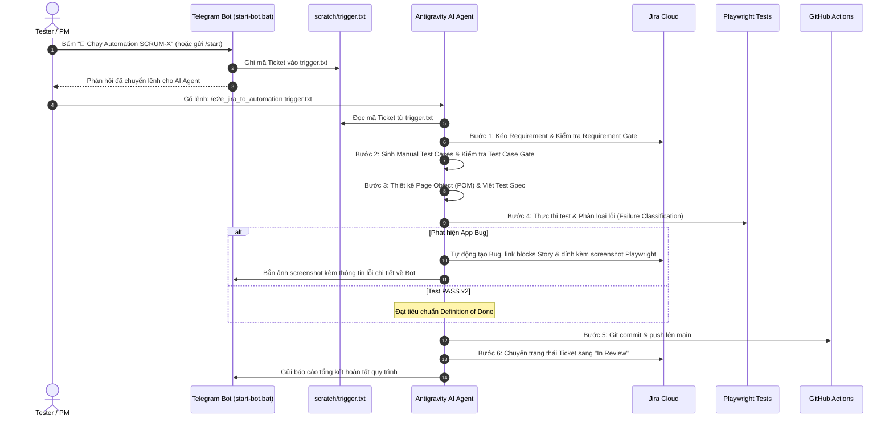

# V Learning — Playwright + TypeScript Automation Framework

Framework kiểm thử tự động toàn diện (End-to-End Automation Testing) cho hệ thống đào tạo trực tuyến **V Learning** (CyberSoft), hỗ trợ cả **Web UI Testing** và **API Testing** trên nền tảng **Playwright + TypeScript**.

---

## 📌 Bảng thông tin hệ thống

| Thông tin | Giá trị |
|---|---|
| **Web UI Target** | `https://demo2.cybersoft.edu.vn/` |
| **API Base URL** | `https://elearningnew.cybersoft.edu.vn` |
| **Tech Stack** | Playwright, TypeScript, Node.js (>= 18) |
| **Design Pattern** | Page Object Model (POM) + Workflow Orchestration |
| **Test Runner** | Playwright Test Runner (`@playwright/test`) |
| **Reporting** | Playwright HTML Report & Allure Report |
| **CI/CD** | GitHub Actions + GitHub Pages (Auto-deploy Allure Report) |
| **Integrations** | Jira Software, Xray Cloud, Telegram Bot Event-Driven Trigger |

---

## 📂 Cấu trúc thư mục dự án

```text
demo-ai-automation/
├── .agent/               # AI QA Automation Rules, Skills & Workflows
├── .github/
│   └── workflows/
│       └── playwright.yml # CI/CD pipeline GitHub Actions & Allure Pages
├── constant/             # Các hằng số URL, timeouts, configuration
├── core/                 # Core utilities: API client, base fixtures, helper functions
├── data-object/          # TypeScript interfaces/models (UI & API request/response)
├── fixture/              # Playwright test fixtures kết hợp POM, Services & Workflows
├── page-object/          # Page Object classes (chỉ chứa locators & actions, không assert)
│   ├── components/       # Header, Footer, Shared Modals
│   ├── forgot-password-page.ts
│   ├── home-page.ts
│   ├── login-page.ts
│   └── register-page.ts
├── requirements/         # Tài liệu yêu cầu chi tiết đồng bộ từ Jira
├── scratch/              # Tệp runtime phục vụ Telegram Bot trigger (notify.js, trigger.txt)
├── scripts/              # Scripts tiện ích: Telegram Bot daemon, Jira integration
│   ├── integrations/jira/
│   │   ├── jira_create_bug.js # Tự động tạo Bug trên Jira + gửi Telegram kèm screenshot
│   │   ├── jira_fetcher.js    # Kéo User Stories/Requirements từ Jira Cloud
│   │   └── jira_transition.js # Tự động chuyển trạng thái Ticket (In Review)
│   └── telegram_bot.js        # Telegram Assistant Bot (Zero-Config, Long-Polling)
├── services/             # API Service wrappers (Auth, User, Course)
├── test-cases/           # Tài liệu Test Cases chuẩn RBT (SCRUM-2, SCRUM-6,...)
├── test-data/            # Dữ liệu kiểm thử ngoại vi
├── tests/                # Test specifications
│   ├── api/              # API Test specs (auth.spec.ts, course.spec.ts)
│   └── ui/               # UI Test specs (login.spec.ts, register.spec.ts, forgot-password.spec.ts)
├── workflow/             # Workflow orchestration (kết hợp Page Objects và API services)
│   ├── api/              # API flows (auth-workflow.ts, course-workflow.ts)
│   └── ui/               # UI flows (login-workflow.ts, course-workflow.ts)
├── .env.example          # Mẫu cấu hình biến môi trường
├── package.json          # Dependencies & npm scripts
├── playwright.config.ts  # Cấu hình Playwright (browsers, viewports, reporters)
├── README.md             # Hướng dẫn dự án chi tiết
└── start-bot.bat         # Script khởi động Telegram Bot nhanh trên Windows
```

---

## ⚙️ Cài đặt & Chuẩn bị môi trường

### 1. Cài đặt Dependencies và Trình duyệt Playwright

Yêu cầu máy tính đã cài đặt **Node.js >= 18**:

```bash
# Cài đặt các thư viện phụ thuộc
npm install

# Cài đặt trình duyệt Chromium cho Playwright
npx playwright install chromium
```

### 2. Thiết lập Biến môi trường (`.env`)

Sao chép file mẫu `.env.example` thành `.env`:

```bash
cp .env.example .env
```

Mở tệp `.env` và điền đầy đủ các thông tin:

```ini
# UI Base URL
UI_BASE_URL=https://demo2.cybersoft.edu.vn

# API Base URL
API_BASE_URL=https://elearningnew.cybersoft.edu.vn

# CyberSoft Platform Token (Bắt buộc cho mọi API request)
TOKEN_CYBERSOFT=eyJhbGciOiJIUzI1NiIsInR5cCI6IkpXVCJ9...

# Mã nhóm bài học / quản lý
MA_NHOM=GP01

# Tài khoản test tĩnh (tùy chọn)
TEST_USERNAME=khai123
TEST_PASSWORD=Password@123

# Cấu hình Jira Integration (tùy chọn)
JIRA_BASE_URL=https://your-domain.atlassian.net
JIRA_EMAIL=your-email@example.com
JIRA_API_TOKEN=your-jira-api-token
JIRA_PROJECT_KEY=SCRUM

# Cấu hình Telegram Bot Trigger (tùy chọn)
TELEGRAM_BOT_TOKEN=your-telegram-bot-token
TELEGRAM_CHAT_ID=your-telegram-chat-id
```

> ⚠️ **Lưu ý bảo mật**: Không bao giờ commit file `.env` chứa token/mật khẩu thật lên Git repository.

---

## 🚀 Hướng dẫn Chạy Test

### 1. Lệnh thực thi cơ bản

```bash
# Chạy tất cả các test (UI và API)
npm test

# Chạy riêng nhóm UI tests
npm run test:ui

# Chạy riêng nhóm API tests
npm run test:api

# Chạy UI test với trình duyệt hiển thị (Headed mode - để quan sát trực quan)
npm run test:headed
```

### 2. Chạy từng file test hoặc test case cụ thể

```bash
# Chạy duy nhất file kiểm thử Đăng ký
npx playwright test tests/ui/register.spec.ts

# Chạy file Quên mật khẩu
npx playwright test tests/ui/forgot-password.spec.ts

# Chạy file Đăng nhập
npx playwright test tests/ui/login.spec.ts

# Chạy test theo tên/mã Test Case cụ thể (sử dụng cờ -g)
npx playwright test -g "TC_REG_01"

# Chạy chế độ UI tương tác của Playwright (Playwright Test UI Mode)
npx playwright test --ui

# Chạy chế độ Debug từng bước (Playwright Inspector)
npx playwright test --debug
```

### 3. Kiểm tra kiểu dữ liệu TypeScript

```bash
npm run typecheck
```

---

## 📊 Xem Báo cáo Kiểm thử (Reporting)

### 1. Báo cáo HTML mặc định của Playwright

Sau khi chạy xong test, xem báo cáo trực quan với biểu đồ, hình chụp và video lỗi:

```bash
npm run report
```

### 2. Báo cáo chuyên nghiệp với Allure Report

```bash
# 1. Chạy toàn bộ test và xuất dữ liệu Allure
npm run test:allure

# 2. Sinh báo cáo Allure HTML tĩnh từ thư mục allure-results
npm run generate:allure

# 3. Khởi chạy máy chủ cục bộ để xem Allure Report trên trình duyệt
npm run report:allure

# 4. Dọn dẹp các thư mục báo cáo và artifacts tạm thời
npm run clean
```

---

## 🤖 Quy trình Vận hành AI Automation End-to-End (Telegram Bot + Antigravity IDE)

Hệ thống hỗ trợ quy trình tự động hóa khép kín: **Jira Cloud ➔ Telegram Bot ➔ Antigravity AI Agent ➔ Playwright Test ➔ Tự động Phân loại & Log Bug ➔ Git Push ➔ CI/CD ➔ Báo cáo Telegram**.



---

### Các bước thực hiện chi tiết:

#### 🔹 Bước 1: Khởi động Telegram Bot Daemon
Mở thư mục dự án trên máy Windows và khởi động bot:
* **Cách 1 (Nhanh nhất):** Nhấp đúp chuột vào file **`start-bot.bat`**.
* **Cách 2 (Dòng lệnh):**
  ```bash
  npm run bot
  # hoặc: node scripts/telegram_bot.js
  ```
> 💡 *Bot chạy ở chế độ Long-Polling (Zero-Config): Không cần cài đặt n8n, không cần mở port hay thiết lập Cloudflare Tunnel.*

---

#### 🔹 Bước 2: Kích hoạt Ticket từ Telegram
1. Mở Telegram và nhắn tin với Bot.
2. Gửi lệnh `/start` hoặc bấm nút **"🔄 Quét lại Jira"**:
   * Bot sẽ tự động truy vấn Jira Cloud và chỉ hiển thị danh sách các User Stories đang ở trạng thái **`In Progress`**.
3. Bấm vào nút inline tương ứng: **"🚀 Chạy Automation SCRUM-X"** (hoặc gửi tin nhắn: `bắt đầu SCRUM-X`):
   * Bot sẽ ghi mã ticket vào file `scratch/trigger.txt`.
   * Bot gửi phản hồi thông báo đã tiếp nhận và sẵn sàng chuyển tiếp cho AI Agent.

---

#### 🔹 Bước 3: Kích hoạt AI Agent trong Antigravity IDE
1. Mở cửa sổ chat của **Antigravity IDE**.
2. Nhập lệnh sau vào ô chat và nhấn Enter:
   ```text
   /e2e_jira_to_automation trigger.txt
   ```
   *(Hoặc bạn có thể gọi trực tiếp theo mã ticket: `/e2e_jira_to_automation SCRUM-X`)*

---

#### 🔹 Bước 4: AI Agent tự động thực thi trọn vẹn 6 bước
AI Agent sẽ tự động đọc `scratch/trigger.txt` và lần lượt thực thi:

1. **Bước 1: Kéo Requirements từ Jira (`/fetch_jira_requirements`)**
   * Tải User Story, Acceptance Criteria và lưu tại `requirements/<KEY>_requirements.md`.
   * Kiểm tra **Requirement Gate**: Đảm bảo yêu cầu rõ ràng, khả thi để kiểm thử.
   * Bắn thông báo tiến độ về Telegram Bot.

2. **Bước 2: Phân tích & Sinh Manual Test Cases (`/generate_testcases_from_requirements`)**
   * Áp dụng kỹ thuật phân vùng tương đương (EP), phân tích giá trị biên (BVA).
   * Lưu bộ test cases chuẩn tại `test-cases/<KEY>_testcases.md`.
   * Kiểm tra **Test Case Gate**: Đảm bảo bao phủ Happy Path, Negative Path và Boundary.
   * Bắn thông báo tiến độ về Telegram Bot.

3. **Bước 3: Thiết kế Page Object (POM) & Test Specs**
   * Tạo/cập nhật Page Objects trong `page-object/` (chỉ chứa Locators & Actions, không chứa assertions).
   * Viết test specs tương ứng trong `tests/ui/<feature>.spec.ts`.
   * Bắn thông báo tiến độ về Telegram Bot.

4. **Bước 4: Chạy Kiểm Thử & Phân Loại Lỗi (Failure Classification)**
   * Chạy kiểm thử tự động với Playwright: `npx playwright test`.
   * **Nếu lỗi do automation (locator/timeout):** Tự kích hoạt Self-Healing sửa code cho đến khi PASS ổn định 2 lần liên tiếp.
   * **Nếu lỗi do ứng dụng (Application Bug / Chưa triển khai logic):**
     * Dừng test, đánh dấu FAILED (tuyệt đối không sửa code test để ép PASS).
     * Tự động lấy ảnh chụp màn hình Playwright vừa chụp tại thời điểm fail (có chứa từ khóa trong ô tìm kiếm).
     * Tự động gọi script `scripts/integrations/jira/jira_create_bug.js`:
       * Tự động đồng bộ 100% Precondition, Steps, Expected Result từ Test Case sang Bug trên Jira.
       * Upload ảnh bằng chứng lên Jira issue.
       * Thiết lập liên kết: Bug ➡️ **blocks** ➡️ User Story.
       * Bắn ảnh chụp bằng chứng lỗi và thông tin chi tiết về Telegram Bot.

5. **Bước 5: Đẩy Mã Nguồn Lên GitHub (Git Delivery)**
   * Kiểm tra `git status`, tạo commit chuẩn Conventional Commits.
   * Tự động `git push origin main` lên GitHub Repository.
   * Bắn thông báo tiến độ về Telegram Bot.

6. **Bước 6: Chuyển Trạng Thái Jira & Báo Cáo Hoàn Tất**
   * Tự động chuyển trạng thái Ticket trên Jira sang **`In Review`** qua script `jira_transition.js`.
   * GitHub Actions CI tự động kích hoạt chạy test suite trên Cloud và cập nhật Allure Report lên GitHub Pages.
   * Bắn thông báo tổng kết cuối cùng về Telegram Bot.

---

## 🔄 CI/CD Pipeline (GitHub Actions)

Dự án đã được cấu hình CI/CD hoàn chỉnh trong `.github/workflows/playwright.yml`:

- **Kích hoạt tự động**: Khi có `push` hoặc `pull_request` vào nhánh `main` / `master`.
- **Hỗ trợ chạy thủ công (`workflow_dispatch`)**: Cho phép chọn chạy toàn bộ (`all`), chỉ UI (`ui`), hoặc chỉ API (`api`).
- **Tự động xuất bản Báo cáo**: Sau khi test xong, GitHub Actions sẽ tự động biên dịch Allure Report và deploy lên **GitHub Pages**.
- **Cấu hình GitHub Secrets cần thiết trong Repository Settings**:
  - `UI_BASE_URL`
  - `API_BASE_URL`
  - `TOKEN_CYBERSOFT`
  - `TEST_USERNAME`
  - `TEST_PASSWORD`

---

## 📐 Kiến trúc & Nguyên tắc Thiết kế (Design Principles)

1. **Page Object Model (POM)**:
   - Tất cả các Locators và Hành vi người dùng (User Actions) nằm trong thư mục `page-object/`.
   - **Không viết `expect()` hay assertions trong Page class**. Tất cả assertion phải nằm trong file `tests/`.
2. **Quy tắc Test Data**:
   - Dữ liệu độc lập và traceable: Tài khoản và email sinh tự động phải unique.
   - Giới hạn độ dài: Hệ thống backend quy định độ dài tài khoản (`taiKhoan`) tối đa là **16 ký tự**. Hàm `generateUsername()` trong `core/utils/string.ts` đã được thiết kế đảm bảo quy chuẩn này.
3. **Smart Waits**:
   - Không sử dụng `Thread.sleep` hay hardcoded `waitForTimeout()`.
   - Sử dụng cơ chế auto-waiting của Playwright và `expect(locator).toBeVisible()`.

---

## 🤖 AI Automation Agent (`.agent/`)

Hệ thống cấu hình và chuẩn hoá cho AI Automation Agent (Rules, Skills và Workflows) trong thư mục `.agent/` được xây dựng, tham khảo và kế thừa từ cộng đồng **[Anh Tester](https://anhtester.com)**:

- **`.agent/rules/`**: Bộ quy tắc chuẩn cho Automation Testing (Quy ước đặt tên POM, chiến lược chọn locator bền vững, quy chuẩn Playwright, Selenium, Appium, API Testing).
- **`.agent/skills/`**: Các bộ kỹ năng chuyên sâu cho AI Agent (QA Automation Engineer, UI Debug, Smart Locator, Locator Healer, Flaky Test Analyzer, Test Data Generator).
- **`.agent/workflows/`**: Quy trình chuẩn hóa thực thi tự động (Phân tích Requirement từ Jira/Website, AI-RBT Manual Testing 6 bước, sinh Test Cases, chuyển đổi sang Automation Script E2E).

> 🌟 **Nguồn tham khảo / Credits:**  
> Toàn bộ tài nguyên, quy chuẩn và kiến trúc `.agent` được tham khảo và phát triển dựa trên chia sẻ từ **[Anh Tester](https://anhtester.com)** — Nền tảng & cộng đồng đào tạo kiểm thử phần mềm tự động (Software Testing & Automation) hàng đầu tại Việt Nam.

