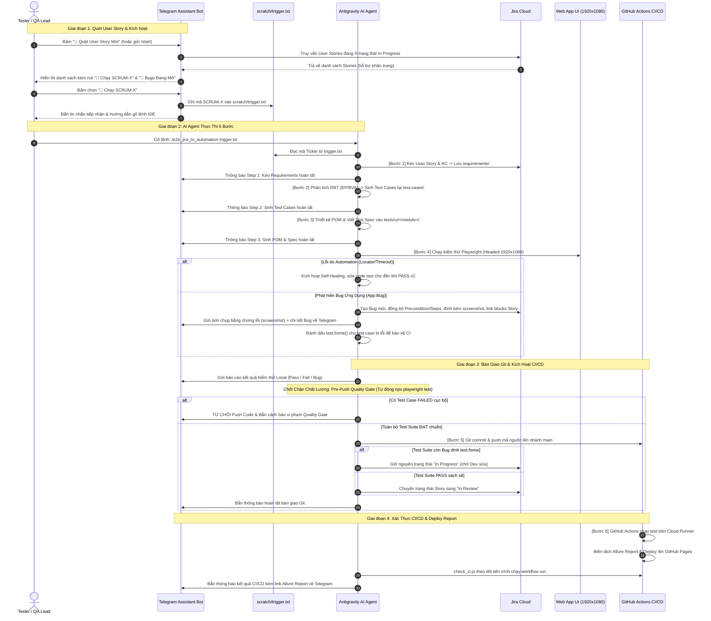
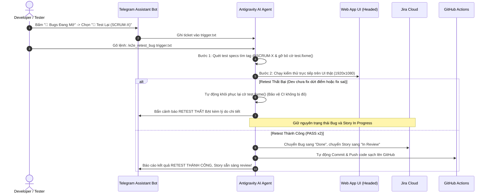

# V Learning — Playwright + TypeScript Automation Framework

Framework kiểm thử tự động toàn diện (End-to-End Test Automation Framework) cho hệ thống đào tạo trực tuyến **V Learning** (CyberSoft), hỗ trợ cả **Web UI Testing** và **API Testing** trên nền tảng **Playwright + TypeScript**, kết hợp hệ sinh thái AI Automation Agent, **Jira Cloud**, **Telegram Assistant Bot** và **GitHub Actions CI/CD Pipeline**.

---

## 📌 Bảng Thông Tin Hệ Thống

| Hạng mục | Thông tin chi tiết |
|---|---|
| **Web UI Target** | [https://demo2.cybersoft.edu.vn/](https://demo2.cybersoft.edu.vn/) |
| **API Base URL** | `https://elearningnew.cybersoft.edu.vn` |
| **Core Technology** | Playwright Test Runner, TypeScript 5.x, Node.js (>= 18) |
| **Design Pattern** | Page Object Model (POM) + Fixture Dependency Injection + Workflow Orchestration |
| **Test Organization** | Phân cấp theo Module thư mục (`tests/ui/<module>/<feature>.spec.ts`) |
| **Traceability** | Liên kết mã Jira thông qua Playwright Semantic Tags (`@<JIRA_KEY>`) |
| **Reporting** | Allure Report (tự động xuất bản GitHub Pages) + Playwright HTML Report |
| **CI/CD Pipeline** | GitHub Actions (Cloud Ubuntu Runner, headless mode, auto-reporting) |
| **Integrations** | Jira Cloud REST API, Telegram Assistant Bot (Event-Driven Long-Polling) |

---

## 📂 Cấu Trúc Thư Mục Dự Án (Project Structure)

Dự án được thiết kế theo kiến trúc chuẩn Enterprise, phân tách rõ ràng giữa Core Utilities, Page Objects, Test Suites, Services và Tầng Tích Hợp (Integration Layer):

```text
demo-ai-automation/
├── .agent/                       # Quy chuẩn, Kỹ năng & Workflows của AI Automation Agent
│   ├── rules/                    # Rules bắt buộc: automation_rules.md, playwright_rules.md, locator_strategy.md
│   ├── skills/                   # Skills chuyên sâu: qa_automation_engineer, ui_debug_agent, smart_locator,...
│   └── workflows/                # Workflows thực thi: e2e_jira_to_automation.md, e2e_retest_bug.md,...
├── .github/
│   └── workflows/
│       └── playwright.yml         # GitHub Actions CI/CD Pipeline & Deploy Allure lên GitHub Pages
├── constant/                     # Hằng số URL, Timeouts, Endpoints dùng chung
├── core/                         # Tiện ích cốt lõi: API Client, Helpers sinh dữ liệu traceable (string.ts)
├── data-object/                  # TypeScript Models & Interfaces cho Request/Response (API & UI)
├── fixture/                      # Playwright Fixtures mở rộng (Dependency Injection POM & Services)
├── page-object/                  # Page Object Classes (Chỉ chứa Locators & User Actions, KHÔNG assert)
│   ├── components/               # Các UI components dùng chung (Header, Footer, Dialogs)
│   ├── base-page.ts              # Lớp cơ sở cung cấp navigation và smart wait helpers
│   ├── cart-page.ts              # Quản lý giỏ hàng & áp dụng mã giảm giá
│   ├── course-page.ts            # Danh sách khóa học, chi tiết khóa học & ghi danh
│   ├── forgot-password-page.ts   # Form quên mật khẩu & khôi phục quyền truy cập
│   ├── home-page.ts              # Trang chủ & thanh tìm kiếm khóa học
│   ├── login-page.ts             # Đăng nhập hệ thống
│   ├── profile-page.ts           # Thông tin tài khoản, danh sách khóa học & đổi avatar
│   └── register-page.ts          # Đăng ký tài khoản học viên mới
├── requirements/                 # Yêu cầu nghiệp vụ đồng bộ tự động từ Jira (<KEY>_requirements.md)
├── scratch/                      # Runtime state cho Telegram Bot & Agent (trigger.txt, jira_state.json)
├── scripts/                      # Bộ công cụ tự động hóa & tích hợp hệ thống
│   ├── integrations/
│   │   ├── check_ci.js           # Theo dõi và xác nhận kết quả chạy GitHub Actions CI/CD
│   │   ├── git_push_delivery.js  # Tự động Commit, Push code & đồng bộ trạng thái Jira
│   │   ├── notify_ci.js          # Gửi thông báo kết quả CI kèm link Allure về Telegram
│   │   ├── notify_step.js        # Bắn thông báo trạng thái từng bước kiểm thử về Telegram
│   │   ├── report_local_test.js  # Báo cáo kết quả kiểm thử local về Telegram
│   │   └── jira/
│   │       ├── jira_create_bug.js# Tự động tạo Bug trên Jira, upload ảnh lỗi & liên kết Story
│   │       ├── jira_fetcher.js   # Kéo User Stories/Requirements từ Jira Cloud
│   │       └── jira_transition.js# Tự động chuyển đổi trạng thái Issue trên Jira
│   ├── utils/                    # Thư viện tiện ích dùng chung (DRY Architecture)
│   │   ├── cli.js                # Parser tham số dòng lệnh chuẩn hóa
│   │   ├── jira_api.js           # Jira REST API client & helpers
│   │   ├── telegram_api.js       # Telegram Bot client đa năng (native fetch Node 18+)
│   │   └── telegram_ui.js        # Giao diện tin nhắn & các nút điều hướng Telegram
│   └── telegram_bot.js           # Telegram Assistant Bot (Event-driven Long-Polling)
├── services/                     # API Service Wrappers (AuthService, UserService, CourseService)
├── test-cases/                   # Bộ Manual Test Cases chuẩn RBT (<KEY>_testcases.md)
├── test-data/                    # Dữ liệu kiểm thử ngoại vi & Fixture files (avatar.png, document.pdf)
│   └── ui/
├── tests/                        # Toàn bộ mã nguồn kiểm thử tự động
│   ├── api/                      # API Test Specifications (auth.spec.ts, course.spec.ts)
│   └── ui/                       # UI Test Specifications (TỔ CHỨC THEO MODULE THƯ MỤC)
│       ├── auth/                 # Module Xác thực: login, register, forgot-password
│       ├── cart/                 # Module Giỏ hàng & Khuyến mãi: cart.spec.ts
│       ├── course/               # Module Khóa học: enroll.spec.ts, search.spec.ts
│       └── profile/              # Module Hồ sơ cá nhân: profile-avatar.spec.ts, profile-courses.spec.ts
├── workflow/                     # Nghiệp vụ liên hoàn kết hợp UI và API (LoginWorkflow, CourseWorkflow)
├── .env.example                  # Mẫu cấu hình biến môi trường
├── docker-compose.yml            # Docker Compose chạy Telegram Assistant Bot ngầm
├── package.json                  # Cấu hình dự án, dependencies và npm scripts
├── playwright.config.ts          # Cấu hình Playwright Test (Browsers, Viewport 1920x1080, Reporters)
└── README.md                     # Tài liệu hướng dẫn toàn diện
```

---

## ⚙️ Cài Đặt & Cấu Hình Môi Trường

### 1. Yêu cầu hệ thống
* **Node.js**: Phiên bản `>= 18.x` trở lên.
* **npm**: Phiên bản `>= 9.x`.
* **Docker & Docker Compose** (nếu muốn chạy Telegram Bot dưới dạng container ngầm).

### 2. Cài đặt Dependencies và Browser Playwright

```bash
# 1. Cài đặt các gói thư viện
npm install

# 2. Cài đặt Chromium Browser cho Playwright
npx playwright install chromium
```

### 3. Thiết lập Biến Môi Trường (`.env`)

Sao chép file `.env.example` thành `.env`:

```bash
cp .env.example .env
```

Điền đầy đủ các thông tin vào `.env`:

```ini
# UI Base URL
UI_BASE_URL=https://demo2.cybersoft.edu.vn

# API Base URL
API_BASE_URL=https://elearningnew.cybersoft.edu.vn

# CyberSoft Platform Token (Bắt buộc cho mọi API request)
TOKEN_CYBERSOFT=eyJhbGciOiJIUzI1NiIsInR5cCI6IkpXVCJ9...

# Mã nhóm bài học / quản lý
MA_NHOM=GP01

# Tài khoản test dùng chung
TEST_USERNAME=khai123
TEST_PASSWORD=Password@123

# Cấu hình tích hợp Jira Cloud
JIRA_BASE_URL=https://your-domain.atlassian.net
JIRA_EMAIL=your-email@example.com
JIRA_API_TOKEN=your-jira-api-token
JIRA_PROJECT_KEY=SCRUM

# Cấu hình tích hợp Telegram Assistant Bot
TELEGRAM_BOT_TOKEN=your-telegram-bot-token
TELEGRAM_CHAT_ID=your-telegram-chat-id

# Cấu hình GitHub Actions CI Checker
GITHUB_TOKEN=your-github-personal-access-token
GITHUB_OWNER=your-github-username
GITHUB_REPO=your-repo-name
```

> ⚠️ **Lưu ý bảo mật:** File `.env` chứa token và mật khẩu thực tế, tuyệt đối **KHÔNG commit** file này lên kho mã nguồn Git.

---

## 🚀 Hướng Dẫn Thực Thi Kiểm Thử (Execution Guide)

### 1. Lệnh thực thi cơ bản

```bash
# Chạy toàn bộ test suites (cả UI và API)
npm test

# Chạy riêng nhóm UI tests
npm run test:ui

# Chạy riêng nhóm API tests
npm run test:api

# Chạy UI test với giao diện trực quan (Headed mode 1920x1080)
npm run test:headed

# Kiểm tra cú pháp và kiểu dữ liệu TypeScript (Zero Error Guarantee)
npm run typecheck
```

### 2. Chạy kiểm thử theo Module Thư Mục

Do toàn bộ UI tests đã được tổ chức theo module, bạn có thể dễ dàng chạy test cho từng phân hệ cụ thể:

```bash
# Chạy toàn bộ test thuộc Module Xác thực (Auth)
npx playwright test tests/ui/auth/

# Chạy toàn bộ test thuộc Module Giỏ hàng (Cart)
npx playwright test tests/ui/cart/

# Chạy toàn bộ test thuộc Module Khóa học (Course)
npx playwright test tests/ui/course/

# Chạy toàn bộ test thuộc Module Hồ sơ cá nhân (Profile)
npx playwright test tests/ui/profile/
```

### 3. Chạy kiểm thử theo Jira Ticket Tag (Traceability)

Hệ thống sử dụng Playwright Tags để gắn mã ticket vào test spec. Bạn có thể chạy nhanh test cho một ticket cụ thể bằng cờ `--grep`:

```bash
# Chạy toàn bộ test cases thuộc ticket SCRUM-18 (Giỏ hàng & Coupon)
npx playwright test --grep @SCRUM-18 --headed

# Chạy toàn bộ test cases thuộc ticket SCRUM-17 (Hủy ghi danh khóa học)
npx playwright test --grep @SCRUM-17 --headed

# Chạy toàn bộ test cases thuộc ticket SCRUM-2 (Đăng ký)
npx playwright test --grep @SCRUM-2
```

### 4. Chế độ Debug và Inspector

```bash
# Mở giao diện tương tác trực quan Playwright Test UI Mode
npx playwright test --ui

# Mở công cụ debug từng bước Playwright Inspector
npx playwright test --debug
```

---

## 📊 Báo Cáo Kiểm Thử (Reporting)

### 1. Playwright HTML Report
```bash
# Xem báo cáo HTML cục bộ kèm trace, screenshot và video
npm run report
```

### 2. Allure Report
```bash
# 1. Chạy kiểm thử và xuất dữ liệu Allure
npm run test:allure

# 2. Sinh báo cáo tĩnh Allure HTML
npm run generate:allure

# 3. Mở máy chủ xem Allure Report trên trình duyệt
npm run report:allure

# 4. Dọn dẹp các thư mục báo cáo tạm
npm run clean
```

---

## 🤖 Luồng Vận Hành End-to-End: Telegram Bot ➔ Jira ➔ AI Agent ➔ Playwright ➔ CI/CD

Quy trình tự động hóa khép kín toàn diện cho phép Tester/QA kích hoạt kiểm thử từ Telegram hoặc IDE, tự động phân loại lỗi, mở Bug trên Jira, tự bảo vệ CI bằng `test.fixme()`, và đẩy mã nguồn lên GitHub.


```mermaid
sequenceDiagram
    autonumber
    actor Tester as Tester / QA Lead
    participant TG as Telegram Assistant Bot
    participant TF as scratch/trigger.txt
    participant IDE as Antigravity AI Agent
    participant Jira as Jira Cloud
    participant App as Web App UI (1920x1080)
    participant Git as GitHub Actions CI/CD

    Note over Tester,TG: Giai đoạn 1: Quét User Story & Kích hoạt
    Tester->>TG: Bấm "🔄 Quét User Story Mới" (hoặc gửi /start)
    TG->>Jira: Truy vấn User Stories đang ở trạng thái In Progress
    Jira-->>TG: Trả về danh sách Stories (hỗ trợ phân trang)
    TG-->>Tester: Hiển thị danh sách kèm nút "🚀 Chạy SCRUM-X" & "🐞 Bugs Đang Mở"
    Tester->>TG: Bấm chọn "🚀 Chạy SCRUM-X"
    TG->>TF: Ghi mã SCRUM-X vào scratch/trigger.txt
    TG-->>Tester: Bắn tin nhắn tiếp nhận & hướng dẫn gõ lệnh IDE

    Note over Tester,IDE: Giai đoạn 2: AI Agent Thực Thi 6 Bước
    Tester->>IDE: Gõ lệnh: /e2e_jira_to_automation trigger.txt
    IDE->>TF: Đọc mã Ticket từ trigger.txt
    
    IDE->>Jira: [Bước 1] Kéo User Story & AC -> Lưu requirements/
    IDE->>TG: Thông báo Step 1: Kéo Requirements hoàn tất

    IDE->>IDE: [Bước 2] Phân tích RBT (EP/BVA) -> Sinh Test Cases tại test-cases/
    IDE->>TG: Thông báo Step 2: Sinh Test Cases hoàn tất

    IDE->>IDE: [Bước 3] Thiết kế POM & Viết Test Spec vào tests/ui/<module>/
    IDE->>TG: Thông báo Step 3: Sinh POM & Spec hoàn tất

    IDE->>App: [Bước 4] Chạy kiểm thử Playwright (Headed 1920x1080)
    alt Lỗi do Automation (Locator/Timeout)
        IDE->>IDE: Kích hoạt Self-Healing, sửa code test cho đến khi PASS x2
    else Phát hiện Bug Ứng Dụng (App Bug)
        IDE->>Jira: Tạo Bug mới, đồng bộ Precondition/Steps, đính kèm screenshot, link blocks Story
        IDE->>TG: Gửi ảnh chụp bằng chứng lỗi (screenshot) + chi tiết Bug về Telegram
        IDE->>IDE: Đánh dấu test.fixme() cho test case bị lỗi để bảo vệ CI
    end

    Note over IDE,Git: Giai đoạn 3: Bàn Giao Git & Kích Hoạt CI/CD
    IDE->>TG: Gửi báo cáo kết quả kiểm thử Local (Pass / Fail / Bug)
    Note over IDE: Chốt Chặn Chất Lượng: Pre-Push Quality Gate (Tự động npx playwright test)
    alt Có Test Case FAILED cục bộ
        IDE->>TG: TỪ CHỐI Push Code & Bắn cảnh báo vi phạm Quality Gate
    else Toàn bộ Test Suite ĐẠT chuẩn
        IDE->>Git: [Bước 5] Git commit & push mã nguồn lên nhánh main
        alt Test Suite còn Bug dính test.fixme
            IDE->>Jira: Giữ nguyên trạng thái "In Progress" (chờ Dev sửa)
        else Test Suite PASS sạch sẽ
            IDE->>Jira: Chuyển trạng thái Story sang "In Review"
        end
        IDE->>TG: Bắn thông báo hoàn tất bàn giao Git
    end

    Note over Git,TG: Giai đoạn 4: Xác Thực CI/CD & Deploy Report
    Git->>Git: [Bước 6] GitHub Actions chạy test trên Cloud Runner
    Git->>Git: Biên dịch Allure Report & Deploy lên GitHub Pages
    IDE->>Git: check_ci.js theo dõi tiến trình chạy workflow run
    IDE->>TG: Bắn thông báo kết quả CI/CD kèm link Allure Report về Telegram
```

---

## 🔄 Luồng Kiểm Thử Lại (Retest Workflow) Khi Dev Báo Sửa Xong Bug

Khi Bug đã được Developer xử lý xong trên Jira, Tester thực hiện quy trình kiểm tra lại tự động thông qua workflow `/e2e_retest_bug`:


```mermaid
sequenceDiagram
    autonumber
    actor Tester as Developer / Tester
    participant TG as Telegram Assistant Bot
    participant IDE as Antigravity AI Agent
    participant App as Web App UI (Headed)
    participant Jira as Jira Cloud
    participant Git as GitHub Actions

    Tester->>TG: Bấm "🐞 Bugs Đang Mở" -> Chọn "🔄 Test Lại (SCRUM-X)"
    TG->>IDE: Ghi ticket vào trigger.txt
    Tester->>IDE: Gõ lệnh: /e2e_retest_bug trigger.txt
    IDE->>IDE: Bước 1: Quét test specs tìm tag @SCRUM-X & gỡ bỏ cờ test.fixme()
    IDE->>App: Bước 2: Chạy kiểm thử trực tiếp trên UI thật (1920x1080)
    
    alt Retest Thất Bại (Dev chưa fix dứt điểm hoặc fix sai)
        IDE->>IDE: Tự động khôi phục lại cờ test.fixme() (Bảo vệ CI không bị đỏ)
        IDE->>TG: Bắn cảnh báo RETEST THẤT BẠI kèm lý do chi tiết
        Note over IDE,Jira: Giữ nguyên trạng thái Bug và Story In Progress
    else Retest Thành Công (PASS x2)
        IDE->>Jira: Chuyển Bug sang "Done", chuyển Story sang "In Review"
        IDE->>Git: Tự động Commit & Push code sạch lên GitHub
        IDE->>TG: Báo cáo kết quả RETEST THÀNH CÔNG, Story sẵn sàng review!
    end
```

---

## 📱 Chi Tiết Tính Năng Telegram Assistant Bot

Bot Telegram được thiết kế theo kiến trúc **Zero-Config, Long-Polling Event-Driven** (có thể chạy local hoặc trong Docker container), đóng vai trò như một bảng điều khiển di động cho toàn bộ hệ thống kiểm thử:

### 1. Quản lý User Stories & Phân Trang Thông Minh
* Gửi `/start` hoặc bấm **"🔄 Quét User Story Mới"**: Bot kết nối Jira API và chỉ lấy các Story ở trạng thái **`In Progress`**.
* Nếu số lượng Story nhiều, Bot tự động chia trang (`Trang 1/2`) kèm các nút chuyển trang `⬅️ Trang trước` / `Trang sau ➡️` để tránh spam giao diện chat.
* Mỗi Story có một nút bấm độc lập: `[🚀 Chạy Automation SCRUM-X]`.

### 2. Quản lý Danh Sách Bug Riêng Biệt
* Nút **`[🐞 Bugs Đang Mở]`**: Mở bảng danh sách các Bug đang chờ xử lý mà không làm rối danh sách User Stories.
* Khi Dev đã sửa xong, Tester chỉ cần bấm `[🔄 Test Lại (SCRUM-X)]` để kích hoạt Retest.

### 3. Báo Cáo Tiến Độ Từng Bước Thời Gian Thực (Step Notifications)
Trong suốt quá trình AI Agent thực thi, Bot liên tục cập nhật tiến độ:
* `[BƯỚC 1/6: Kéo Requirements từ Jira]`
* `[BƯỚC 2/6: Sinh Manual Test Cases]`
* `[BƯỚC 3/6: Viết Page Object & Test Specs]`
* `[BƯỚC 4/6: Chạy Kiểm Thử & Phân Loại Lỗi]`
* `[BƯỚC 5/6: Bàn Giao Git & Cập Nhật Jira]`
* `[BƯỚC 6/6: Kiểm Tra CI/CD Trên GitHub Actions]`

### 4. Đính Kèm Ảnh Chụp Lỗi (Screenshot Evidence) Tự Động
Khi phát hiện Bug ứng dụng ở Bước 4, script `jira_create_bug.js` tự động lấy screenshot lỗi từ Playwright và gửi trực tiếp thành tin nhắn hình ảnh về Telegram kèm đầy đủ thông tin:
* Mã Bug vừa tạo trên Jira (`SCRUM-XX`).
* Mã User Story bị block.
* Các bước tái hiện (Steps to Reproduce) và Kết quả thực tế (Actual Result).

### 5. Khởi Chạy Telegram Bot Bằng Docker Compose

Container bot được cấu hình `restart: unless-stopped` giúp duy trì hoạt động liên tục:

```bash
# Khởi chạy container Bot chạy ngầm
npm run docker:up
# hoặc: docker compose up -d

# Xem log trực tiếp của Bot
npm run docker:logs
# hoặc: docker compose logs -f

# Dừng container Bot
npm run docker:down
# hoặc: docker compose down
```

---

## 📐 Quy Chuẩn Code & Kiến Trúc Kiểm Thử (Standards & Conventions)

### 1. Quy chuẩn Thư mục & Đặt tên Test Specs
* **Tổ chức theo Module:** Mọi file kiểm thử UI bắt buộc phải nằm trong thư mục module nghiệp vụ:
  ```text
  tests/ui/<module>/<feature>.spec.ts
  ```
* **CẤM đặt tên file theo mã ticket:** Tuyệt đối không tạo các file như `tests/ui/SCRUM-18.spec.ts`. Tên file phải đại diện cho tính năng của hệ thống (`cart.spec.ts`, `login.spec.ts`, `profile-courses.spec.ts`).
* **Tái sử dụng file spec (DRY):** Khi có ticket Jira mới cùng module (ví dụ ticket mới về Cart), Agent **bắt buộc mở rộng file spec hiện có** của module đó, không tạo file trùng lặp.
* **Traceability bằng Tags:** Liên kết ticket qua tag:
  ```typescript
  test.describe('SCRUM-18: [Cart] Thêm khóa học vào Giỏ hàng', { tag: ['@SCRUM-18', '@cart'] }, () => {
    test('TC01: Thêm vào giỏ thành công', async ({ cartPage }) => { ... });
  });
  ```

### 2. Quy chuẩn Page Object Model (POM)
* **Phân tách trách nhiệm:**
  * **Page Class (`page-object/`):** Chỉ chứa Locators và Hành vi người dùng (Actions). Tuyệt đối **không chứa assertions** (`expect()`).
  * **Test Specs (`tests/`):** Nhận Page Object qua Playwright Fixtures, thực hiện các bước và Web-First Assertions (`await expect(locator).toBeVisible()`).
* **Tránh Hard Sleep:** Cấm hoàn toàn `waitForTimeout()` hoặc fixed delay. Sử dụng smart auto-waiting của Playwright.

### 3. Quy chuẩn Test Data
* Dữ liệu cho các trường yêu cầu unique (tài khoản, email) bắt buộc phải sinh động qua `core/utils/string.ts` (`generateUsername()`, `generateEmail()`).
* Dữ liệu phải mang tính **traceable** (chứa timestamp và prefix) để dễ dàng tra cứu trong database khi cần debug.
* Tài khoản tạo mới tuân thủ giới hạn backend của CyberSoft: độ dài `<= 16 ký tự`.

### 4. Cơ chế CI Safety (`test.fixme`)
* Khi phát hiện lỗi ứng dụng (Bug), test case được chuyển thành `test.fixme(...)`:
  ```typescript
  // Đánh dấu fixme do Bug SCRUM-22 trên Jira: Không hiển thị hộp thoại xác nhận khi Hủy khóa học
  test.fixme('TC02: Hủy ghi danh khóa học thành công', async ({ profilePage }) => { ... });
  ```
* Cơ chế này giúp:
  1. Toàn bộ mã nguồn kiểm thử vẫn được lưu giữ đầy đủ trên Git.
  2. GitHub Actions CI/CD Pipeline luôn **PASS XANH 100%** (vì test case này được skip an toàn).
  3. Khi Dev sửa xong Bug, Tester chỉ cần chạy `/e2e_retest_bug` để tự động kích hoạt lại test case.

---

## 🛠️ GitHub Actions CI/CD Pipeline

Pipeline CI/CD trong `.github/workflows/playwright.yml` tự động vận hành mỗi khi có commit mới đẩy lên nhánh `main`:

1. **Environment Setup**: Khởi tạo Node.js 18 trên Ubuntu Cloud Runner.
2. **Dependencies & Cache**: Cài đặt npm packages và Playwright Browsers có lưu cache để tối ưu thời gian build.
3. **Execution**: Chạy toàn bộ test suites ở chế độ Headless.
4. **Allure Publishing**: Tự động biên dịch Allure Report và xuất bản lên **GitHub Pages** (`https://<username>.github.io/<repo>/`).
5. **Telegram Notification**: Job `notify` gửi tin nhắn tóm tắt kết quả (Pass/Fail, Commit hash, Tác giả, Link Allure Report) trực tiếp về Telegram.

---

## 🤝 Lời Cảm Ơn & Nguồn Tham Khảo

Hệ thống cấu hình, quy chuẩn và bộ kỹ năng AI Automation Agent (`.agent/`) trong dự án được xây dựng, nghiên cứu và kế thừa từ các kiến thức chia sẻ quý báu của cộng đồng **[Anh Tester](https://anhtester.com)** — Nền tảng & cộng đồng đào tạo kiểm thử phần mềm tự động (Automation Testing) hàng đầu tại Việt Nam.

---

## 📄 Bản Quyền & Giấy Phép

Dự án được phát triển phục vụ mục đích kiểm thử tự động hệ thống học tập V Learning và nghiên cứu áp dụng Agentic AI vào quy trình QA/QC hiện đại.
Mọi đóng góp và cải tiến vui lòng tạo Pull Request hoặc liên hệ qua kênh Telegram của dự án.
